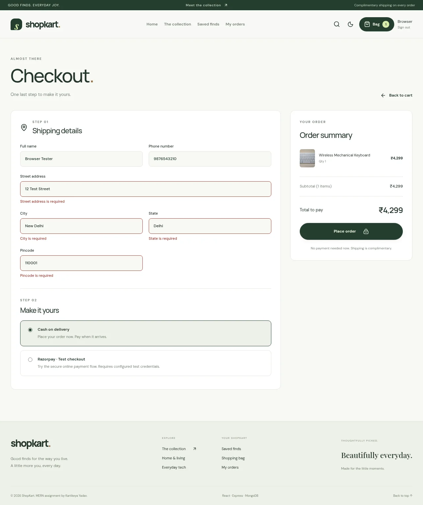
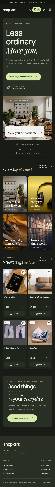
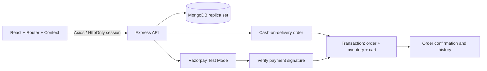

<p align="center"></p>

<h1 align="center">ShopKart.</h1>
<p align="center"><strong>Less ordinary. More you.</strong><br />A complete MERN shopping assignment with a considered storefront and a working order journey.</p>
<p align="center"><a href="https://github.com/kartikeyajay2006/2nd-Year-MERN-P_S">GitHub repository</a> · <a href="#run-in-two-commands">Quick start</a> · <a href="#what-works">Features</a> · <a href="#verification">Verification</a></p>

## Run in two commands

Use **Node.js 20.19+** (Node 22 recommended), npm, and internet access for the first installation and MongoDB binary download. From the repository root:

```bash
npm run setup
npm run dev
```

Open **http://127.0.0.1:5173** or **http://localhost:5173**. The API runs on port **3000** and the local MongoDB replica set runs on **27018**. Register your own account; no shared demo password is required.

The runner starts a real local MongoDB process, seeds 41 products, and launches both apps. It stores database files and a generated session secret in ignored `.local-data/`. Accounts, carts, wishlists, orders and stock persist across restarts. Catalog seeding inserts missing examples and **does not reset purchased stock**. Stop with **Ctrl+C**. MongoDB is bound to the local loopback interface. The first run downloads a MongoDB binary (about 123 MB); later runs reuse it.

**No API keys are required for the complete cash-on-delivery journey.** Razorpay is an additional **Test Mode** payment option and requires your own test credentials. This is an academic storefront: COD records an order; it does not book a real courier or fulfillment service.

## What works

| Area              | Implemented behavior                                                                                                                                       |
| ----------------- | ---------------------------------------------------------------------------------------------------------------------------------------------------------- |
| Storefront        | Public browsing, editorial hero, four linked collections, live featured products, personalized shortcuts                                                   |
| Product discovery | Debounced search, category tabs, price/name sorting, stock filter, filter reset, shareable filter URLs, product details                                    |
| Accounts          | Registration validation, normalized email, bcrypt password hashes, HttpOnly JWT cookie, sign-in, logout, protected customer pages, return to intended page |
| Wishlist          | Add **and remove** using the heart, shared saved state, wishlist page, details and add-to-bag actions                                                      |
| Shopping bag      | Persistent cart, quantity controls, remove item, stock limits, accurate INR totals, shared navbar count                                                    |
| Checkout          | Validated Indian shipping address, server-calculated totals, complimentary shipping, **cash on delivery** and optional **Razorpay Test Mode**              |
| Orders            | Persistent order confirmation, history, ownership checks, purchase-time item snapshots, payment method, actual status timeline                             |
| Inventory         | Transactional order placement and stock reduction, overselling protection, idempotent payment verification, preservation of later cart additions           |
| Experience        | Responsive layouts, light/dark preference persistence, short transitions, skeletons, notifications, useful empty/error states, image fallback              |
| Accessibility     | Semantic landmarks, labeled controls, keyboard focus, skip link, live notifications, mobile menu state, reduced-motion support                             |

## The redesigned interface

The frontend uses a warm cream and forest palette, soft typography, editorial photography, rounded controls and restrained motion. Dark mode uses an olive charcoal palette. Animations use opacity and transform; users who prefer reduced motion receive a static experience.

<p align="center"></p>

<details>
<summary>See dark mode, checkout and mobile views</summary>





</details>

Screenshots show the running app. Hero and collection photographs are bundled locally. Catalog photographs use Unsplash URLs and have a local fallback if unavailable. Fonts use Google Fonts with system fallbacks.

## Assignment structure

The final runnable application lives in **`Lab-03-ShopKart-Product-Discovery/`**. Labs 04–06 document the wishlist, cart and checkout additions to that connected app. Labs 01–02 remain earlier standalone exercises.

```text
2nd-Year-MERN-P_S/
├── scripts/dev.cjs                   # Starts persistent local MongoDB, API and UI
├── Lab-01-ShopKart-Auth/             # Earlier authentication exercise
├── Lab-02-ShopKart-Client/           # Earlier React client exercise
├── Lab-03-ShopKart-Product-Discovery/
│   ├── backend/
│   │   ├── controllers/ models/ routes/ middlewares/
│   │   ├── utils/order.js            # Order snapshots + transaction helpers
│   │   ├── seed.js                   # 41 sample products; preserves existing stock
│   │   └── test/shop-flow.test.js    # Real MongoDB integration tests
│   └── frontend/
│       ├── src/components/ context/ pages/ services/
│       ├── public/images/           # Bundled collection photography + fallback
│       └── tests/storefront.spec.js  # Browser shopping journeys
├── Lab-04-ShopKart-Wishlist/
├── Lab-05-ShopKart-Shopping-Cart/
├── Lab-06-ShopKart-Checkout-Orders/
└── docs/PROJECT_REVIEW.md            # Findings, fixes and remaining boundaries
```



## Use your own MongoDB or payment credentials

The root runner is for local development. For an existing **MongoDB replica set** or **MongoDB Atlas**, start the apps independently:

```bash
cd Lab-03-ShopKart-Product-Discovery/backend
cp .env.example .env
# Set MONGO_URI, JWT_SECRET and CLIENT_URL in this ignored file.
npm ci
npm run seed
npm start
```

In a second terminal:

```bash
cd Lab-03-ShopKart-Product-Discovery/frontend
npm ci
npm run dev -- --host 127.0.0.1
```

`MONGO_URI` must target a replica set because orders use transactions. A standalone MongoDB server is sufficient for catalog reads but cannot complete transactional checkout. Use the root runner or Atlas to run every feature.

| Backend variable      | Purpose                                                                 |
| --------------------- | ----------------------------------------------------------------------- |
| `PORT`                | API port; default `3000`                                                |
| `MONGO_URI`           | MongoDB connection string; required for independent API startup         |
| `JWT_SECRET`          | Long random signing secret; required for independent API startup        |
| `CLIENT_URL`          | Exact frontend origin allowed by CORS and origin checks                 |
| `RAZORPAY_KEY_ID`     | Optional Razorpay test key ID (`rzp_test_...`)                          |
| `RAZORPAY_KEY_SECRET` | Optional server-only test key secret                                    |
| `NODE_ENV`            | Set to `production` for Secure cookies and stricter account rate limits |

The frontend accepts **`VITE_API_URL`** when your API runs at another address. Keep frontend and API on the **same hostname/site** for the Strict session cookie. The default API address follows the browser hostname on port 3000. Never put the Razorpay secret or JWT secret in a `VITE_` variable.

To try Razorpay with the root runner, copy the backend `.env.example` to `.env` and supply your test keys; the API reads that ignored file. The runner provides its own local database URL and session secret. Browsing and COD remain available if payment credentials are absent.

## API routes

| Method                      | Route                               | Access / purpose                                           |
| --------------------------- | ----------------------------------- | ---------------------------------------------------------- |
| POST                        | `/customers/register`               | Public; create account                                     |
| POST                        | `/customers/login`                  | Public; set session cookie                                 |
| GET                         | `/customers/me`                     | Customer profile                                           |
| POST                        | `/customers/logout`                 | Clear cookie                                               |
| GET                         | `/products?search=&category=`       | Public catalog                                             |
| GET                         | `/products/:id`                     | Public product details                                     |
| GET / POST / DELETE         | `/wishlist`, `/wishlist/:productId` | Customer saved products                                    |
| GET / POST / PATCH / DELETE | `/cart`, `/cart/:productId`         | Customer cart and quantity                                 |
| POST                        | `/orders/cash-on-delivery`          | Customer; transactional COD order                          |
| POST                        | `/orders/create-payment-order`      | Customer; Razorpay test order                              |
| POST                        | `/orders/verify-payment`            | Customer; signature verification + transactional placement |
| GET                         | `/orders`, `/orders/:id`            | Customer's own order history/details                       |
| GET                         | `/health`                           | API/database readiness                                     |

Wishlist, cart and order APIs derive the customer from the session. There is no public catalog-write endpoint. Product creation happens through the seed script; an admin dashboard is outside this assignment.

## Verification

```bash
# From the repository root:
npm test
npm run build

# With npm run dev active in another terminal:
cd Lab-03-ShopKart-Product-Discovery/frontend
npm run test:e2e
```

The browser suite uses installed Google Chrome by default. If it is unavailable, run `npx playwright install chromium` and use `E2E_CHROME_CHANNEL=chromium npm run test:e2e`. Browser tests create a unique test account and a real COD order in your local database.

- **Six API test groups** use an isolated MongoDB replica set: wishlist/cart isolation, stock limits, mocked Razorpay verification, repeated verification, validation, unauthorized writes/origins, COD totals, duplicate checkout and competing orders for the last unit.
- **Two browser journeys** cover registration/login, product discovery, product details, wishlist toggling/removal, cart quantities, shipping validation, COD, confirmation after refresh, order history, logout, price sorting, empty results, mobile navigation and theme persistence.
- The **production build** compiles every page. Active backend/frontend dependency audits report **zero known vulnerabilities** at the time of this update.
- Razorpay API responses are mocked in automated tests. A live Razorpay Test Mode transaction still needs your credentials and network access; it has not been claimed as verified here.

## Security and submission

Secrets, `.env` files, dependencies, build output, local database files and test artifacts are ignored. Only blank/example environment configuration is tracked. Authentication uses hashed passwords and HttpOnly cookies; order ownership, request origin checks, account rate limits and server-side validation protect the connected app.

**Submission repository:** https://github.com/kartikeyajay2006/2nd-Year-MERN-P_S

**Deployment:** optional; no live deployment is included. For deployment, use a Node host plus Atlas, build the React app, provide environment variables through the host, configure SPA fallback and use HTTPS with frontend and API on the same site. The local MongoDB runner is not a production database service.

**Author:** [Kartikeya Yadav / kartikeyajay2006](https://github.com/kartikeyajay2006)

Photographs: Unsplash, using image references in the catalog seed. Earlier generated README artwork remains in `docs/assets/`.
