<picture>
  <source media="(prefers-color-scheme: dark)" srcset="docs/assets/banner-dark.svg" />
  
</picture>

<p align="center">
  <a href="https://github.com/kartikeyajay2006/2nd-Year-MERN-P_S/actions/workflows/ci.yml"></a>
  
  
  
  
  
  
</p>

<p align="center">
  <b>A complete MERN shopping assignment</b> — browse, save, bag and check out, with real orders and stock stored in MongoDB.
  <br />
  <a href="#-see-it-in-action">Demo</a> ·
  <a href="#-run-it-in-two-commands">Quick start</a> ·
  <a href="#-a-tour-of-the-store">Screens</a> ·
  <a href="#-what-works">Features</a> ·
  <a href="#-how-it-works">Architecture</a> ·
  <a href="#-tests">Tests</a>
</p>

## 🎬 See it in action

<p align="center">
  
</p>
<p align="center"><sub>A real recording of the running app: collection → search → wishlist → bag → checkout → order confirmed.</sub></p>

## 🚀 Run it in two commands

You need **Node.js 20.19+** (22 recommended) and internet access for the first install. From the repository root:

```bash
npm run setup   # installs API + web dependencies
npm run dev     # starts MongoDB, seeds the catalog, launches API and web app
```

Open **http://localhost:5173** and create an account. No API keys, no demo password, no manual MongoDB install.

| Service             | Address                    | Notes                                                    |
| ------------------- | -------------------------- | -------------------------------------------------------- |
| 🛍️ Storefront (Vite) | http://localhost:5173      | React app                                                |
| ⚙️ API (Express)     | http://localhost:3000      | `GET /health` reports database readiness                 |
| 🍃 MongoDB          | 127.0.0.1:27018            | Local replica set, data kept in ignored `.local-data/`   |

The runner seeds **41 products** and keeps accounts, carts, wishlists, orders and stock across restarts — re-seeding only adds missing products and never resets purchased stock. The first run downloads a MongoDB binary (~123 MB). Stop everything with **Ctrl+C**.

> [!NOTE]
> **Cash on delivery** completes the whole journey with no credentials. **Razorpay Test Mode** is an optional extra that needs your own test keys. This is an academic store: an order is recorded, but no real courier is booked.

## 🖼️ A tour of the store

<table>
  <tr>
    <td width="50%">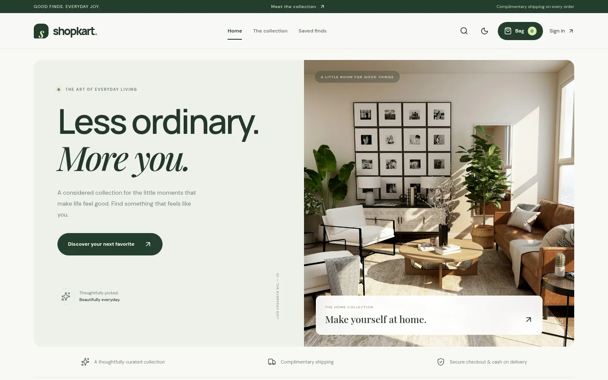</td>
    <td width="50%">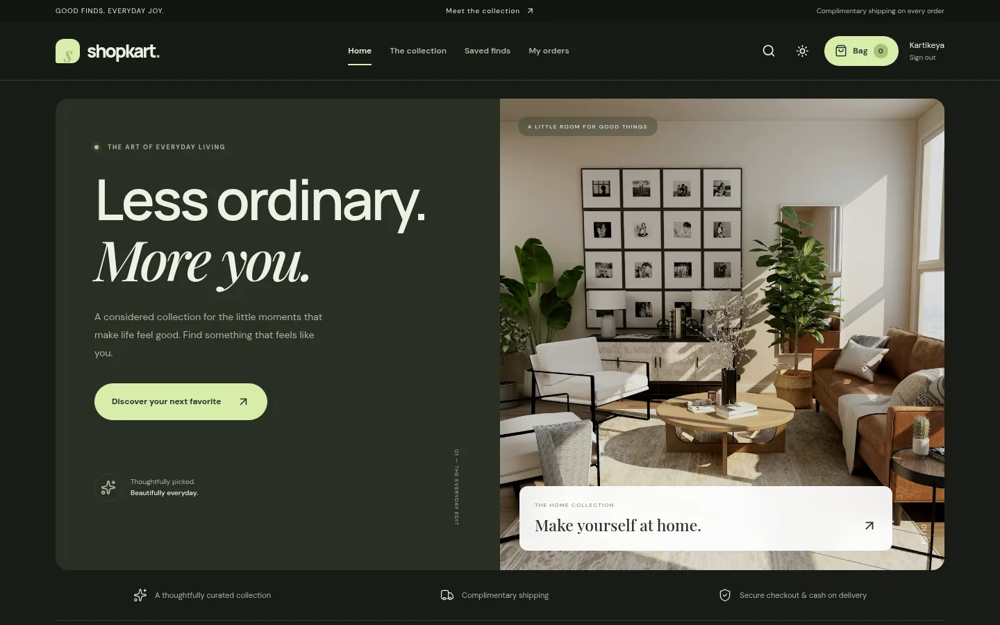</td>
  </tr>
  <tr>
    <td align="center"><sub><b>Home</b> · editorial hero and collections</sub></td>
    <td align="center"><sub><b>Dark mode</b> · remembered between visits</sub></td>
  </tr>
  <tr>
    <td>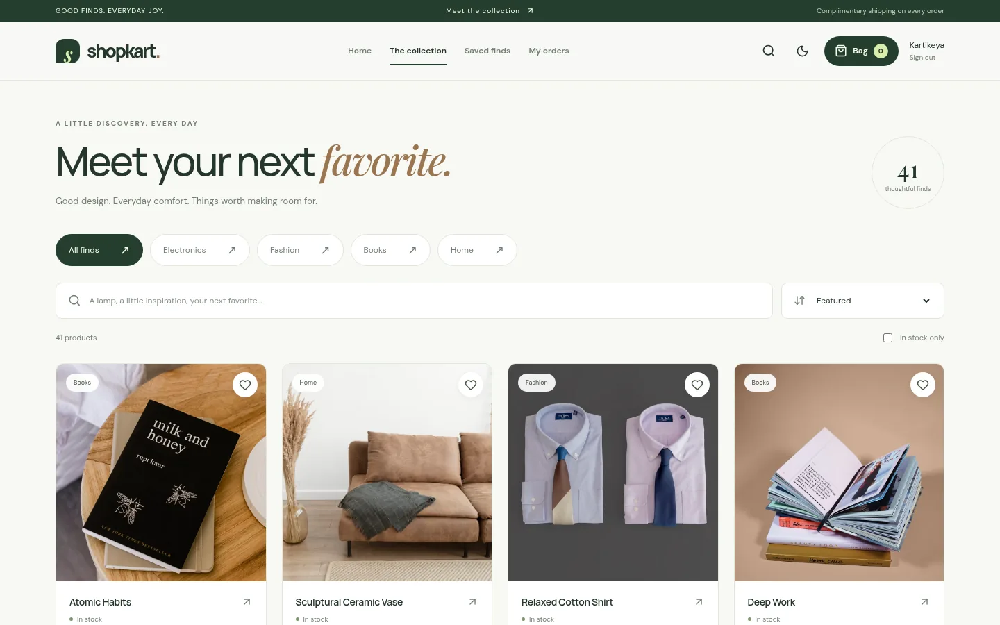</td>
    <td>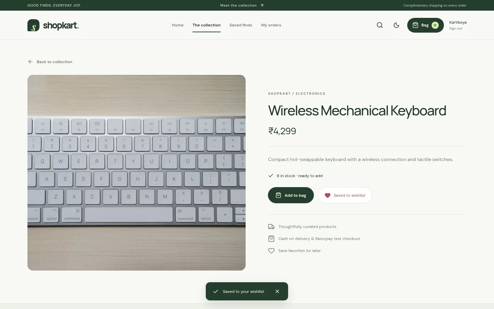</td>
  </tr>
  <tr>
    <td align="center"><sub><b>Collection</b> · search, categories, sort, in-stock filter</sub></td>
    <td align="center"><sub><b>Product details</b> · stock, add to bag, save</sub></td>
  </tr>
  <tr>
    <td>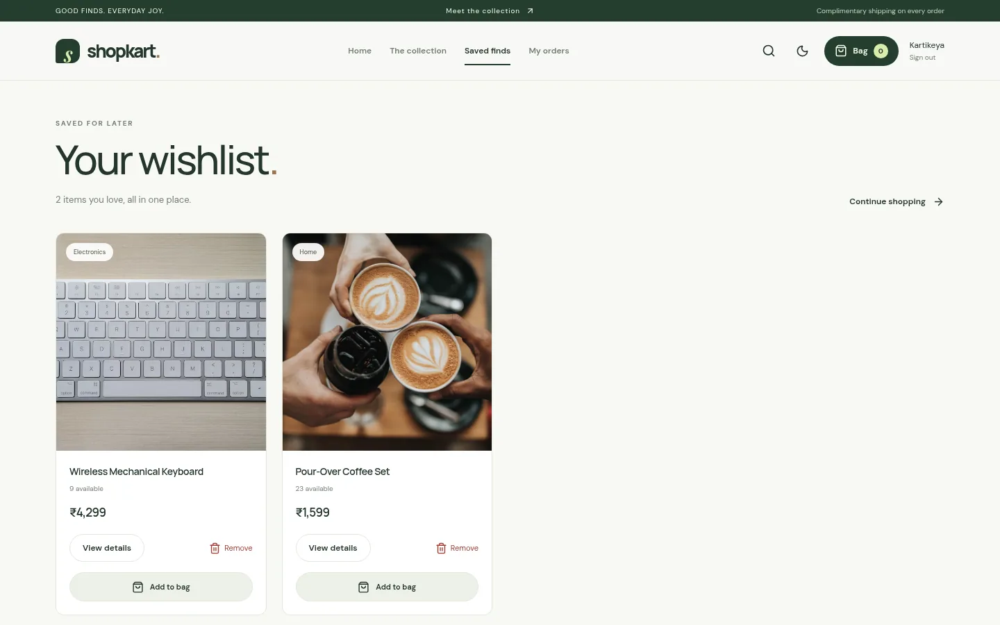</td>
    <td>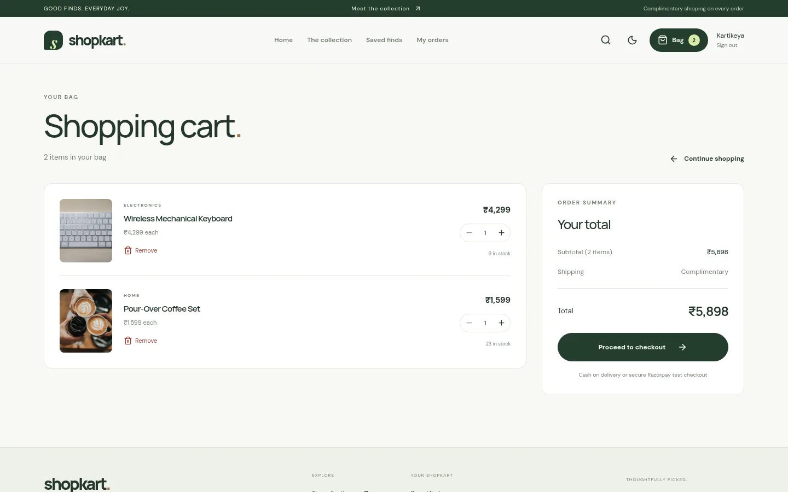</td>
  </tr>
  <tr>
    <td align="center"><sub><b>Wishlist</b> · heart to add or remove</sub></td>
    <td align="center"><sub><b>Bag</b> · quantities limited by stock</sub></td>
  </tr>
  <tr>
    <td>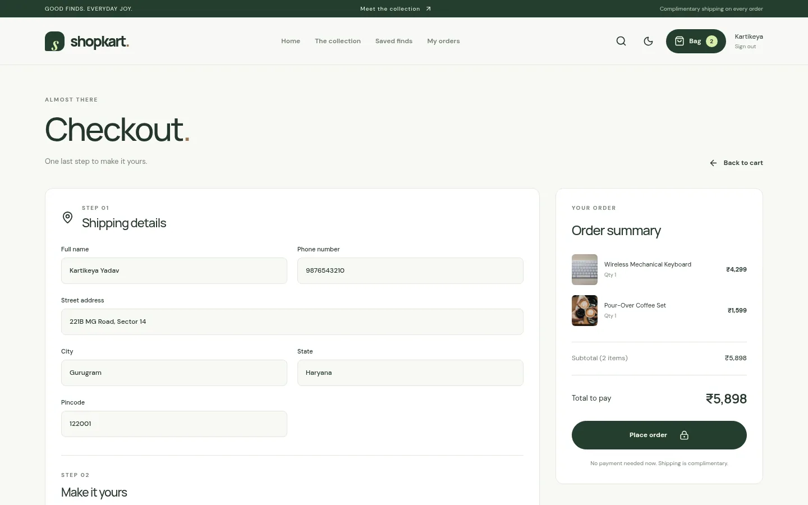</td>
    <td>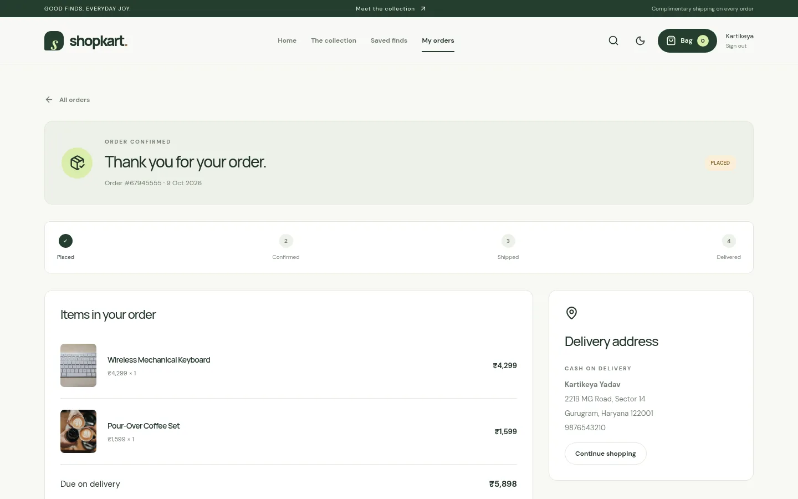</td>
  </tr>
  <tr>
    <td align="center"><sub><b>Checkout</b> · validated Indian address</sub></td>
    <td align="center"><sub><b>Order confirmed</b> · saved snapshot and timeline</sub></td>
  </tr>
</table>

<p align="center">
  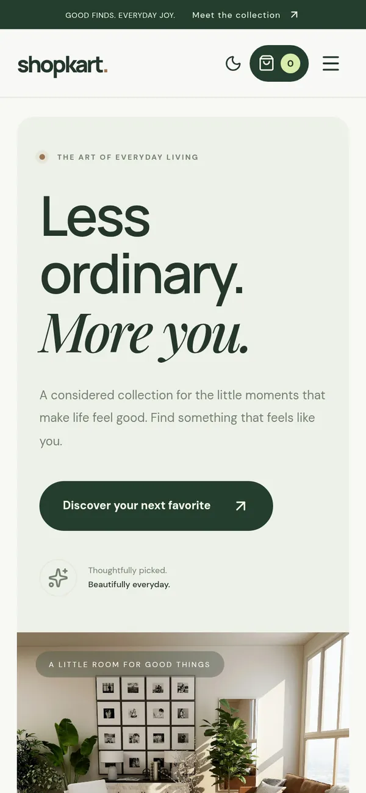
  &nbsp;
  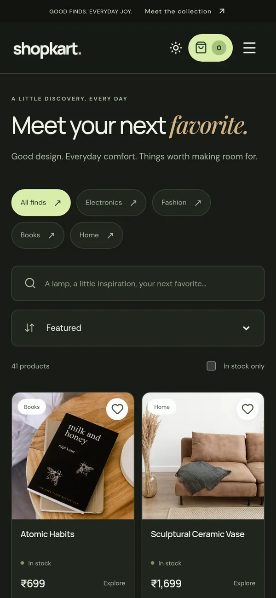
  &nbsp;
  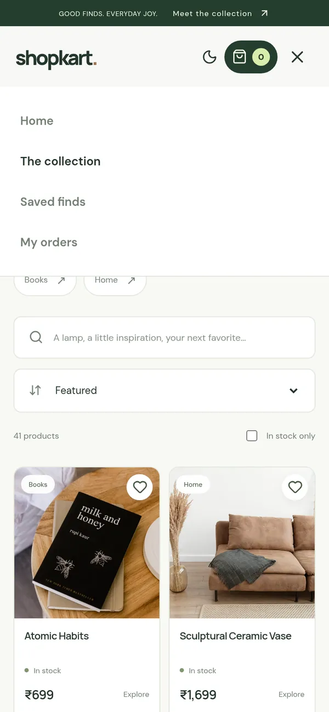
</p>
<p align="center"><sub><b>Mobile</b> · responsive layout, slide-down menu, no sideways scrolling</sub></p>

<details>
<summary><b>More screens</b> — sign up, order history, dark collection</summary>
<br />
<table>
  <tr>
    <td width="33%">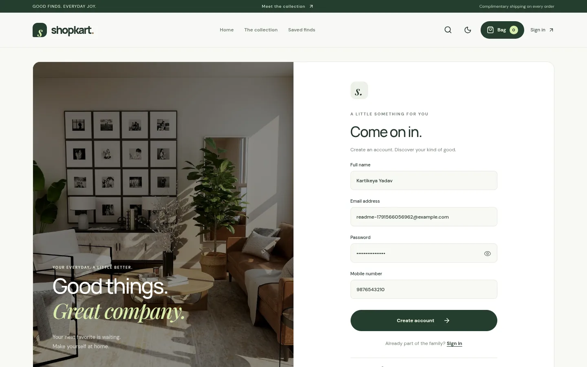</td>
    <td width="33%">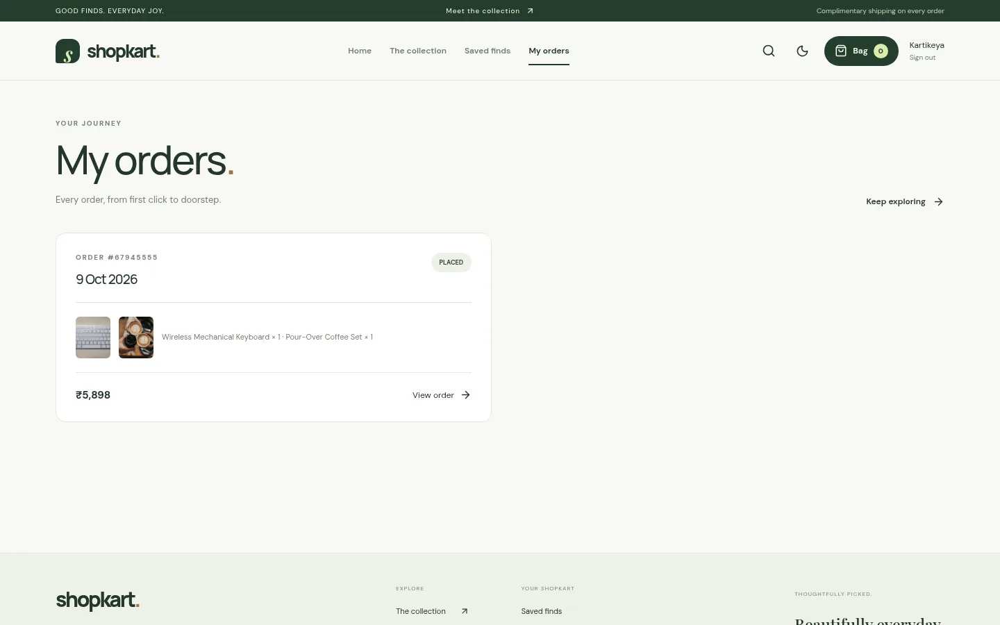</td>
    <td width="33%">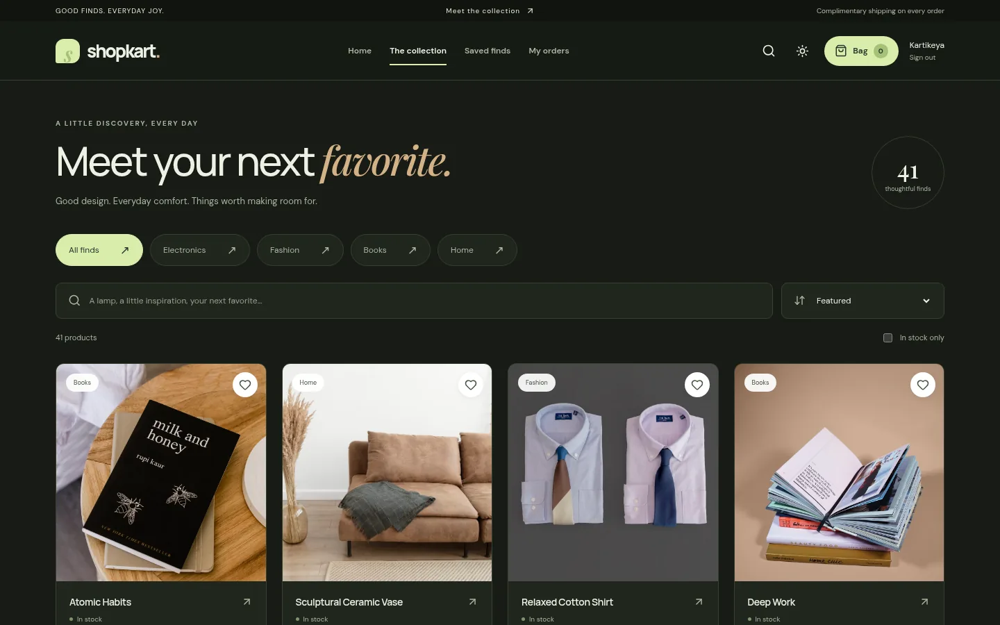</td>
  </tr>
  <tr>
    <td align="center"><sub>Create account</sub></td>
    <td align="center"><sub>My orders</sub></td>
    <td align="center"><sub>Collection · dark</sub></td>
  </tr>
</table>
</details>

<sub>All screenshots are taken from the running app. Hero and collection photos are bundled in the frontend; catalog photos come from Unsplash with a local fallback image.</sub>

## ✨ What works

| | Area | What you get |
| :-: | --- | --- |
| 🏠 | **Storefront** | Public browsing, editorial hero, four linked collections, live featured products |
| 🔎 | **Discovery** | Debounced search, category tabs, price/name sort, in-stock filter, reset, shareable filter URLs |
| 👤 | **Accounts** | Validated sign-up, normalized email, bcrypt hashes, HttpOnly JWT cookie, return to the page you wanted |
| ❤️ | **Wishlist** | Add **and** remove from the heart anywhere, shared saved state, add to bag from the list |
| 🛍️ | **Bag** | Persistent cart, quantity controls, stock limits, exact INR totals, live navbar count |
| 💳 | **Checkout** | Indian address validation, server-calculated totals, free shipping, **COD** or **Razorpay Test Mode** |
| 📦 | **Orders** | Confirmation, history, ownership checks, purchase-time item snapshots, status timeline |
| 🧮 | **Inventory** | Order + stock + cart updated in **one MongoDB transaction** — no overselling the last unit |
| 🌗 | **Experience** | Light/dark theme, skeletons, toasts, helpful empty and error states, image fallback |
| ♿ | **Accessibility** | Landmarks, labeled controls, visible focus, skip link, live notifications, reduced-motion support |

## 🧭 How it works

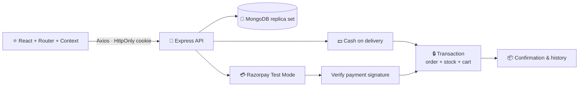

<details>
<summary><b>What happens when you press “Place order”</b></summary>

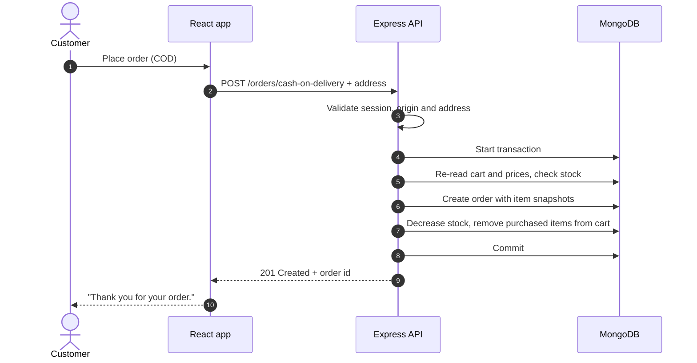

If two customers race for the last unit, only one transaction commits; the other gets a stock conflict and nothing is half-written.
</details>

**Stack**

| Layer | Tools |
| --- | --- |
| Frontend | React 18, React Router 7, Vite 6, Axios, Context API, lucide-react |
| Backend | Express 5, Mongoose 9, bcrypt, jsonwebtoken, cookie-parser, express-rate-limit, Razorpay SDK |
| Database | MongoDB replica set (local via `mongodb-memory-server`, or Atlas) |
| Testing | `node:test`, Supertest, nock, Playwright, GitHub Actions |

## 🗂️ Project structure

The runnable app lives in **`Lab-03-ShopKart-Product-Discovery/`**. Labs 04–06 document the wishlist, cart and checkout work added to that same app; Labs 01–02 are the earlier standalone exercises.

```text
2nd-Year-MERN-P_S/
├── scripts/dev.cjs                    # one command: MongoDB + seed + API + web
├── Lab-01-ShopKart-Auth/              # earlier auth exercise
├── Lab-02-ShopKart-Client/            # earlier React client exercise
├── Lab-03-ShopKart-Product-Discovery/ # ★ the final app
│   ├── backend/
│   │   ├── controllers/ models/ routes/ middlewares/
│   │   ├── utils/order.js             # order snapshots + transaction helpers
│   │   ├── seed.js                    # 41 products, keeps existing stock
│   │   └── test/shop-flow.test.js     # API tests on a real replica set
│   └── frontend/
│       ├── src/components/ context/ pages/ services/
│       ├── public/images/             # bundled photos + fallback
│       └── tests/storefront.spec.js   # browser journeys
├── Lab-04-ShopKart-Wishlist/
├── Lab-05-ShopKart-Shopping-Cart/
├── Lab-06-ShopKart-Checkout-Orders/
└── docs/
    ├── PROJECT_REVIEW.md              # findings, fixes and known limits
    └── assets/                        # README banner, demo and screenshots
```

## 🔌 API routes

<details>
<summary>Show all routes</summary>

| Method | Route | Access · purpose |
| --- | --- | --- |
| `POST` | `/customers/register` | Public · create account |
| `POST` | `/customers/login` | Public · set session cookie |
| `GET` | `/customers/me` | Customer profile |
| `POST` | `/customers/logout` | Clear cookie |
| `GET` | `/products?search=&category=` | Public catalog |
| `GET` | `/products/:id` | Public product details |
| `GET` `POST` `DELETE` | `/wishlist`, `/wishlist/:productId` | Saved products |
| `GET` `POST` `PATCH` `DELETE` | `/cart`, `/cart/:productId` | Cart and quantities |
| `POST` | `/orders/cash-on-delivery` | Transactional COD order |
| `POST` | `/orders/create-payment-order` | Razorpay test order |
| `POST` | `/orders/verify-payment` | Signature check + transactional placement |
| `GET` | `/orders`, `/orders/:id` | Your own orders |
| `GET` | `/health` | API and database readiness |

Wishlist, cart and order routes take the customer from the session, never from the request body. There is no public endpoint for writing products — the seed script manages the catalog.
</details>

## ⚙️ Use your own MongoDB or Razorpay keys

<details>
<summary>Run the API and web app separately (Atlas or your own replica set)</summary>

```bash
cd Lab-03-ShopKart-Product-Discovery/backend
cp .env.example .env      # set MONGO_URI, JWT_SECRET, CLIENT_URL
npm ci && npm run seed && npm start
```

In a second terminal:

```bash
cd Lab-03-ShopKart-Product-Discovery/frontend
npm ci && npm run dev -- --host 127.0.0.1
```

`MONGO_URI` must point to a **replica set** (or Atlas) because orders use transactions. A standalone server can serve the catalog but cannot complete checkout.

| Variable | Purpose |
| --- | --- |
| `PORT` | API port, default `3000` |
| `MONGO_URI` | MongoDB connection string |
| `JWT_SECRET` | Long random secret for signing sessions |
| `CLIENT_URL` | Exact frontend origin allowed by CORS and origin checks |
| `RAZORPAY_KEY_ID` | Optional test key (`rzp_test_...`) |
| `RAZORPAY_KEY_SECRET` | Optional, server-only test secret |
| `NODE_ENV` | `production` enables Secure cookies and stricter rate limits |

The frontend reads **`VITE_API_URL`** if the API is elsewhere; keep both on the same site so the Strict session cookie works. Never put the JWT or Razorpay secret in a `VITE_` variable.

To try Razorpay with `npm run dev`, copy the backend `.env.example` to `.env` and add your test keys — the runner supplies the database URL and session secret itself.
</details>

## 🧪 Tests

```bash
npm test          # API tests on an isolated MongoDB replica set
npm run build     # production build of every page

# with `npm run dev` running in another terminal:
cd Lab-03-ShopKart-Product-Discovery/frontend
npm run test:e2e  # Playwright browser journeys
```

- **6 API test groups** — wishlist/cart isolation, stock limits, mocked Razorpay verification and replay, input validation, unauthorized writes and origins, COD totals, duplicate checkout, and two buyers racing for the last unit.
- **2 browser journeys** — sign-up to sign-out with wishlist, bag, address validation, COD and order history; plus sorting, empty results, theme persistence and mobile navigation.
- **CI** runs setup, API tests, the build and both browser journeys on every push to `main`.

The browser tests use installed Google Chrome. Without it, run `npx playwright install chromium` and then `E2E_CHROME_CHANNEL=chromium npm run test:e2e`. Razorpay responses are mocked in tests; a live Test Mode payment needs your own keys and is not claimed as verified.

## 🔐 Security and limits

- Passwords are hashed with bcrypt; sessions live in **HttpOnly** cookies (Secure in production).
- Order ownership, request-origin checks, account rate limits and server-side validation guard every customer route.
- `.env` files, dependencies, build output, local database files and test artifacts are git-ignored; only example env files are tracked.
- Not included: real payments, refunds, admin dashboard, password recovery or courier booking. See [docs/PROJECT_REVIEW.md](docs/PROJECT_REVIEW.md) for the full list of findings and boundaries.

**Deployment:** not live. To deploy, use a Node host with MongoDB Atlas, build the React app, set env vars on the host, add an SPA fallback, and serve frontend and API over HTTPS on the same site.

---

<p align="center">
  Made by <a href="https://github.com/kartikeyajay2006"><b>Kartikeya Yadav</b></a> · 2nd-year MERN lab assignment
  <br />
  <sub>Photography: Unsplash · Fonts: DM Sans, Manrope, Playfair Display</sub>
</p>
