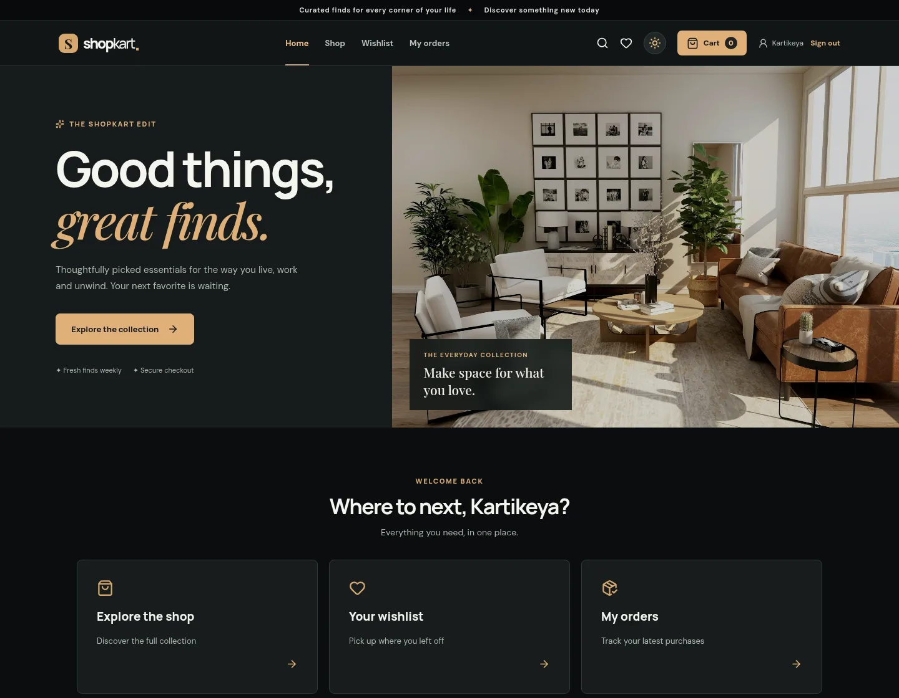
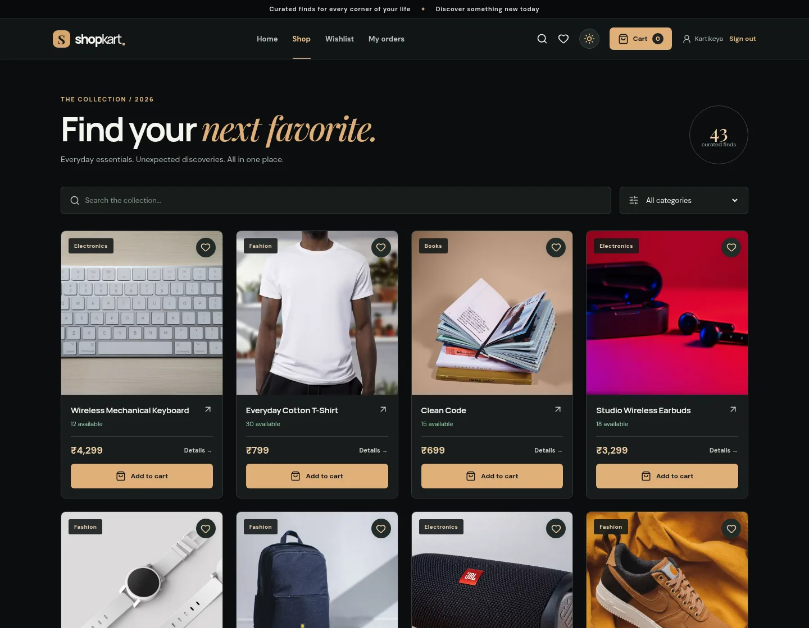
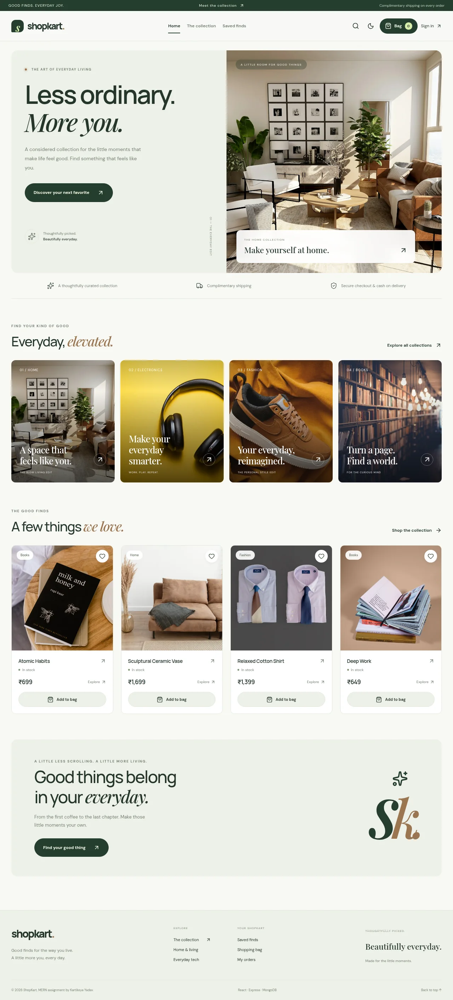
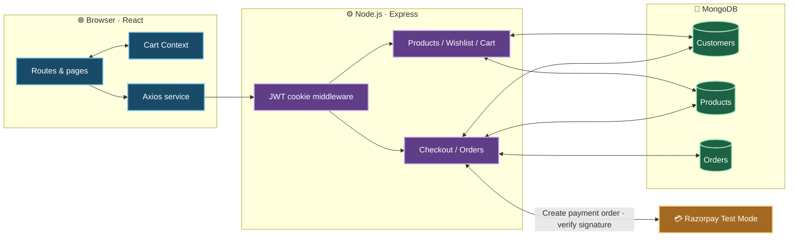

<p align="center">
  
</p>

<h1 align="center">ShopKart 🛍️</h1>
<p align="center"><strong>A connected MERN shopping experience, built across six engineering labs.</strong></p>
<p align="center">Discover products · Save favorites · Build a cart · Pay securely · Revisit orders</p>

<p align="center">
  
  
  
  
</p>

<p align="center">
  <a href="#see-it-in-action">See the app</a> ·
  <a href="#the-shopping-journey">Shopping journey</a> ·
  <a href="#architecture">Architecture</a> ·
  <a href="#run-locally">Run locally</a>
</p>

---

## See it in action

These are **screenshots of the running React app**, using the local ShopKart catalog. The interface has a high contrast dark theme and a navbar toggle that remembers the user's light or dark preference.

<p align="center">
  
</p>

<p align="center"><em>Home · dark theme</em></p>

<p align="center">
  
</p>

<p align="center"><em>Product discovery · live catalog</em></p>

<details>
  <summary><strong>☀️ See the light theme</strong></summary>
  <br />
  
</details>

The living-room image in the home page is bundled with the app, so that hero section loads without relying on a live image host. Product images come from the seeded catalog.

## The shopping journey

```mermaid
flowchart LR
    A["🔐 Register / sign in"] --> B["🔎 Search & filter products"]
    B --> C["❤️ Save to wishlist"]
    B --> D["🛒 Add to cart"]
    C --> D
    D --> E["📍 Enter shipping details"]
    E --> F["💳 Razorpay Test Checkout"]
    F --> G["✅ Verify payment"]
    G --> H["📦 Order history"]

    classDef account fill:#244737,stroke:#d9b17d,color:#ffffff,stroke-width:2px;
    classDef discover fill:#22577a,stroke:#87c9f0,color:#ffffff,stroke-width:2px;
    classDef save fill:#873d64,stroke:#ffb6d3,color:#ffffff,stroke-width:2px;
    classDef cart fill:#9a621f,stroke:#f4c780,color:#ffffff,stroke-width:2px;
    classDef pay fill:#513b85,stroke:#c7b4ff,color:#ffffff,stroke-width:2px;
    classDef done fill:#216947,stroke:#a8e1ba,color:#ffffff,stroke-width:2px;
    class A account;
    class B discover;
    class C save;
    class D,E cart;
    class F,G pay;
    class H done;
```

<p align="center">
  
</p>



### What each lab adds

| Lab | Feature | What you can try |
| :-- | :-- | :-- |
| [01 · Auth API](./Lab-01-ShopKart-Auth/) | Customer accounts | Register, sign in, protected profile |
| [02 · React client](./Lab-02-ShopKart-Client/README.md) | Browser session | Login UI, protected routes, logout |
| [03 · Discovery](./Lab-03-ShopKart-Product-Discovery/README.md) | Product catalog | Search, categories, product details, **41 seeded examples** |
| [04 · Wishlist](./Lab-04-ShopKart-Wishlist/README.md) | Saved products | Save, view, remove, return later |
| [05 · Cart](./Lab-05-ShopKart-Shopping-Cart/README.md) | Shopping bag | Add, adjust quantity, stock checks, subtotal |
| [06 · Checkout](./Lab-06-ShopKart-Checkout-Orders/README.md) | Payment and orders | Shipping, Razorpay Test Mode, confirmation, history |

> **One connected app:** Labs 01 and 02 remain as earlier standalone exercises. The runnable Labs 03–06 journey lives in [Lab-03-ShopKart-Product-Discovery](./Lab-03-ShopKart-Product-Discovery/README.md), sharing one API, frontend, database, and session.

## Architecture



**The important boundaries:** wishlist and cart store Product references; orders store purchase-time name, price, image, and quantity snapshots. The backend reloads product data, checks stock, and calculates the total. It marks an order paid and clears the cart only after verifying the Razorpay signature.

## Run locally

**Requirements:** Node.js 20+, MongoDB, and two terminals. Razorpay **Test Mode** keys are needed only to complete the payment step.

**Terminal 1 — API and seed data**

```bash
cd Lab-03-ShopKart-Product-Discovery/backend
npm install
cp .env.example .env
```

Edit `backend/.env` with your local settings:

```env
PORT=3000
MONGO_URI=mongodb://127.0.0.1:27017/shopkart
CLIENT_URL=http://127.0.0.1:5173
JWT_SECRET=replace_with_a_long_random_secret
RAZORPAY_KEY_ID=rzp_test_your_key_id
RAZORPAY_KEY_SECRET=your_test_key_secret
```

```bash
npm run seed
npm start
```

**Terminal 2 — frontend**

```bash
cd Lab-03-ShopKart-Product-Discovery/frontend
npm install
npm run dev -- --host 127.0.0.1
```

Open **http://127.0.0.1:5173**. Use the same hostname for the frontend and API so the HttpOnly session cookie is sent correctly. The seed is safe to rerun: it updates its 41 named sample products and keeps other products already in your database.

### Verify the build

```bash
cd Lab-03-ShopKart-Product-Discovery/backend
npm test

cd ../frontend
npm run build
```

The backend integration test uses in-memory MongoDB and a mocked Razorpay Orders API. A real Test Mode payment requires your own Razorpay credentials.

## Explore the code

| Area | Start here |
| :-- | :-- |
| Express API | [Backend entry point](./Lab-03-ShopKart-Product-Discovery/backend/index.js) |
| React app | [Routes](./Lab-03-ShopKart-Product-Discovery/frontend/src/App.jsx) |
| Product examples | [Idempotent catalog seed](./Lab-03-ShopKart-Product-Discovery/backend/seed.js) |
| Shared cart state | [Cart Context](./Lab-03-ShopKart-Product-Discovery/frontend/src/context/CartContext.jsx) |
| Payment safeguards | [Order controller](./Lab-03-ShopKart-Product-Discovery/backend/controllers/order.controller.js) |
| Full API route list | [Connected app guide](./Lab-03-ShopKart-Product-Discovery/README.md#routes) |

<p align="center"><strong>Browse → Save → Cart → Checkout → Orders</strong></p>
<p align="center"><sub>3D artwork generated for this README. UI screenshots are from the running app. Living-room photograph from <a href="https://images.unsplash.com/photo-1600210492486-724fe5c67fb0">Unsplash</a>.</sub></p>
